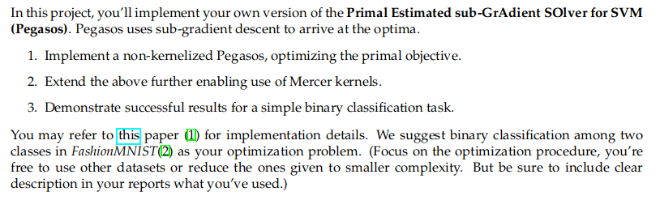
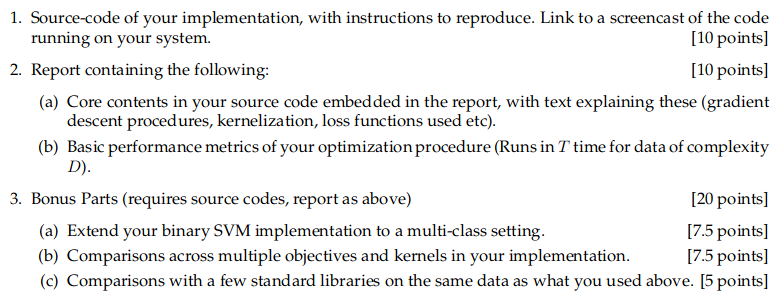
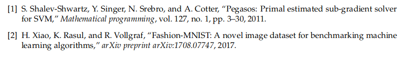

Pegasos is *Primal Estimated sub-gradient Solver for SVM*, which is an improved version of SVM, that uses sub-gradient descent to arrive at the optima

It has been implemented from scratch, for classifying fashion mnist dataset

- Two types of classifiers have been built
  - Binary and Multi Class

## Structure of the project
###### Pegasos.ipynb contains the implementations of pegasos, along with pictures from the snippets of pseudo-code
###### Testing.ipynb was for comparing Pegasos with Scikit-learn libraries
###### OM Report.pdf contains the report, with the following details specified, below

## Requirements
Overview of the project

Submission Requirements

References

